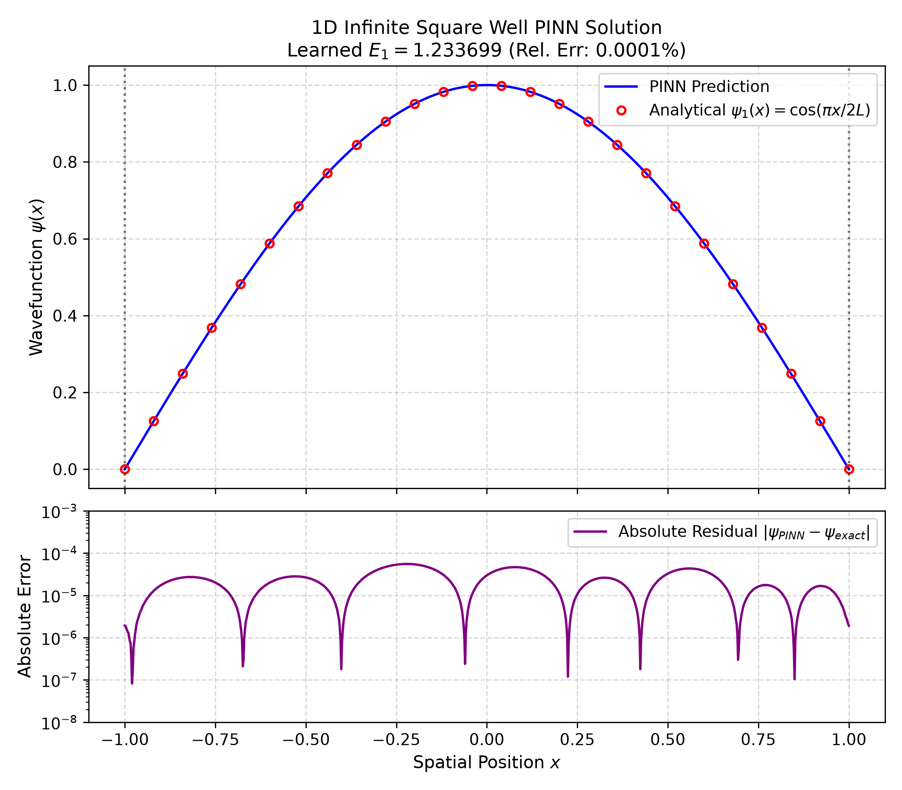

# Schrödinger PINN (in progress)

A physics-informed neural network that **discovers** the ground-state energy of the 1-D
time-independent Schrödinger equation, rather than being trained against a known solution.
The energy $E$ is a free parameter of the model, optimized jointly with the network weights.

On the infinite potential well the model recovers $E_1 = \pi^2/8 = 1.233701$ to an absolute
error of $2\times10^{-6}$ (0.0002% relative), in ~17 s on CPU.

<p align="center">
  
</p>

## Results

| Potential | Exact $E_1$ | Discovered $E_1$ | Rel. error |
|---|---|---|---|
| Infinite well, $L=1$ | 1.233701 | 1.233703 | 0.0002% |

## Method

We solve the time-independent Schrödinger equation

$$-\frac{\hbar^2}{2m}\frac{\mathrm{d}^2\psi(x)}{\mathrm{d}x^2} + V(x)\psi(x) = E\psi(x)$$

in natural units, $\hbar = m = 1$:

$$-\frac{1}{2}\psi''(x) + V(x)\psi(x) = E\psi(x)$$

on the domain $x \in [-L, L]$ with $L = 1$ and $V(x) = 0$ inside the well, for which the
analytic ground state is $\psi_1(x) = \cos(\pi x / 2L)$ with $E_1 = \pi^2/8$.

A fully-connected network $\psi_\theta(x)$ (4 hidden layers, width 50) is evaluated at $N = 200$
collocation points, with $\psi''$ obtained by automatic differentiation. The energy $E$ is an
`nn.Parameter` initialized at $1.0$ and optimized alongside $\theta$, so the eigenvalue is an
output of training rather than an input.

Three residuals are minimized:

**PDE residual** — the equation itself, enforced pointwise:

$$\mathcal{L}\_{\text{pde}} = \frac{1}{N}\sum_{i=1}^{N}\left|-\tfrac{1}{2}\psi''(x_i) + V(x_i)\psi(x_i) - E\psi(x_i)\right|^2$$

**Boundary condition** — the walls are infinite, so $\psi$ must vanish at both edges:

$$\mathcal{L}\_{\text{bc}} = \tfrac{1}{2}\left(|\psi(-L)|^2 + |\psi(L)|^2\right)$$

**Normalization** — without this the trivial solution $\psi \equiv 0$ satisfies everything above:

$$\mathcal{L}\_{\text{norm}} = \left(\sum_{i=1}^{N}|\psi(x_i)|^2\,\Delta x - 1\right)^2$$

combined as

$$\mathcal{L}\_{\text{total}} = w\_{\text{pde}}\mathcal{L}\_{\text{pde}} + w\_{\text{bc}}\mathcal{L}\_{\text{bc}} + w\_{\text{norm}}\mathcal{L}\_{\text{norm}}$$

with $w_{\text{pde}} = 1$ and $w_{\text{bc}} = w_{\text{norm}} = 10$. The constraint terms are
weighted higher because they are exact conditions, whereas the PDE residual is only sampled.

Training runs in two phases: 5000 epochs of **Adam** ($\text{lr}=10^{-3}$) to reach the correct
basin, followed by 500 steps of **L-BFGS** with strong-Wolfe line search to converge within it.
Adam alone plateaus around $10^{-4}$ in the loss; L-BFGS takes it two further orders of
magnitude and gains roughly two digits in $E$.

## Installation

```bash
git clone https://github.com/JOTELLECHEA/schrodinger-pinn.git
cd schrodinger-pinn
python3 -m venv venv
source venv/bin/activate
pip install --upgrade pip
pip install -r requirements.txt
```

## Training

```bash
python train.py
```

Expected output:

```
Initial Energy Guess E: 1.0000
-------- Starting Phase 1: Adam Optimizer --------
Adam:   100%|██████████| 5000/5000 [00:14<00:00, 352.44it/s, loss=8.247e-05, E=1.232271]
------- Starting Phase 2: L-BFGS Optimizer -------
L-BFGS: 100%|██████████| 500/500 [00:02<00:00, 209.61it/s, loss=1.887e-06, E=1.233703]
--------------- Training Complete ----------------
Exact Ground State E:    1.233701
Discovered Ground State: 1.233703
Absolute Error:          0.000002
Relative Error:          0.0002%
```

The trained model is written to `outputs/checkpoints/pinn_tise.pt`.

## Limitations

- **No guarantee of the ground state.** The PDE residual is minimized by *any* eigenpair
  $(\psi_n, E_n)$; nothing in the loss prefers $n = 1$. Convergence to $E_1$ here follows from
  initializing $E = 1.0$, below $\pi^2/8$. Initializing near 5.0 converges instead to
  $E_2 = \pi^2/2$.
- **Validation is against a known solution.** The infinite well was chosen because it has a
  closed form to check against, which makes it a test of the method rather than a use of it.

## Author & License

- **Author:** Jonathan Tellechea
- **License:** MIT (see [LICENSE](LICENSE))